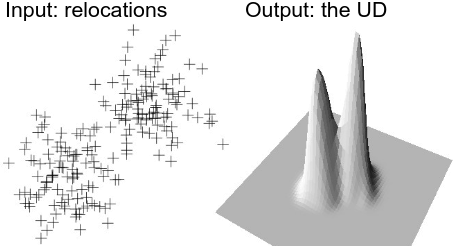
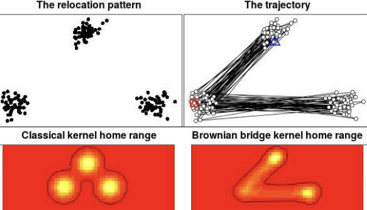
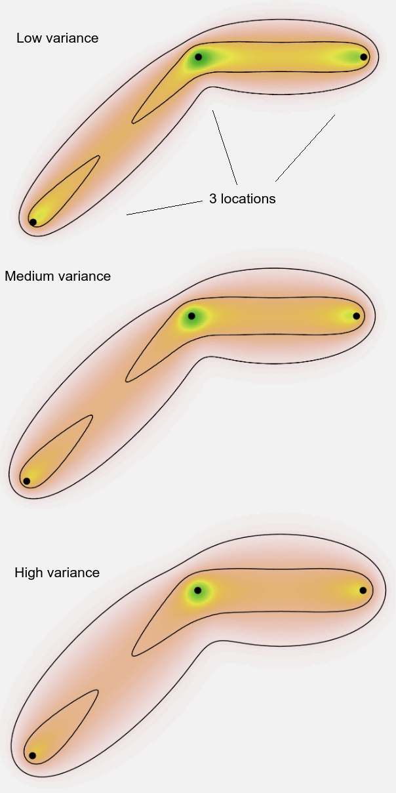
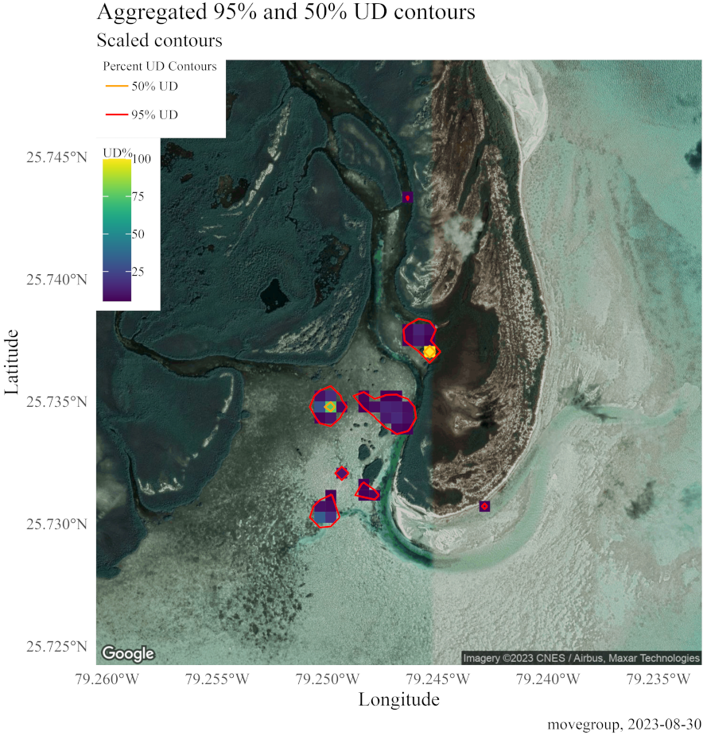

<!-- README.md is generated from README.Rmd. Please edit that file -->

# movegroup

<!-- badges: start -->

[](https://zenodo.org/doi/10.5281/zenodo.10607926)
[](https://github.com/SimonDedman/movegroup/actions/workflows/R-CMD-check.yaml)
[](https://cran.r-project.org/package=movegroup)
[](https://cran.r-project.org/package=movegroup)
<!-- badges: end -->
<!-- badgeplacer(location = ".", status = "active", githubaccount = SimonDedman, githubrepo = movegroup, branch = master, name = "README.Rmd") -->

### Install, help, background reading

To install on Linux systems it may be required to type, in terminal:

``` r
sudo apt install libgeos-dev
sudo apt install libproj-dev
sudo apt install libgdal-dev
```

then manually install `rgeos` and `rgdal` in R/RStudio. However be
advised these packages are being depreciated in late-2023.

The `cropsavedimage` parameter in the plotraster function crops the
output image, removing excess whitespace, and uses `magick::image_trim`.
`magick` requires system preinstall.

``` r
deb: libmagick++-dev (Debian, Ubuntu)
rpm: ImageMagick-c++-devel (Fedora, CentOS, RHEL)
csw: imagemagick_dev (Solaris)
brew: imagemagick@6 (MacOS)
```

Also see each script’s Details section in the manual pages, as these
frequently contain tips or common bugfixes.

------------------------------------------------------------------------

### Academic background and rationale

An animal’s home range can be defined as the area traversed by an animal
within which it engages in normal activities e.g., foraging, mating
([Burt,
1943](https://academic.oup.com/jmammal/article-abstract/24/3/346/894801)).
The most basic home range estimation method is the minimum convex
polygon (MCP), which draws a polygon enclosing all relocations ([Mohr,
1947](https://www.jstor.org/stable/2421652)). However, due to
subjectivity of the home range definition, a new term was coined: the
utilization distribution (UD; [Winkle,
1975](https://www.jstor.org/stable/3800474)).

The UD is an improvement upon the MCP-derived home range estimation
because this definition not only quantifies the size of a tracked
animal’s home range, but also the intensity with which sub-areas within
the home range are used ([Worton,
1989](https://esajournals.onlinelibrary.wiley.com/doi/10.2307/1938423)).
The kernel utilization distribution (KUD) is the first method that
incorporated UDs for home range estimation. This method applies a
bivariate kernel function over each location fix, after which resulting
values are averaged. However, the KUD assumes no spatial and temporal
autocorrelation in the data, which is of course unrealistic in the
context of animal movement data that are inherently spatially and
temporarily autocorrelated.

<figure>

<figcaption aria-hidden="true">Relocations and UD</figcaption>
</figure>

[Horne et
al. (2007)](https://esajournals.onlinelibrary.wiley.com/doi/10.1890/06-0957.1)
describe the use of movement models that incorporate Brownian motion
(Brownian bridge moment model, BBMM), which offers a more sophisticated
way to estimate space use. The traditional BBMM integrates the temporal
component of tracking data by explicitly modeling movements between
consecutive relocations. This is achieved by accounting for both the
order of subsequent relocations as well as the travel time between them.
The BBMM reconstructs the movement path by computing biased random walk
iterations, creating a probability density distribution or “bridge”
between two consecutive relocations where the animal could have been
when it was not detected.

<figure>

<figcaption aria-hidden="true">KUD vs BBKUD</figcaption>
</figure>

A minimal time difference among relocations is then suggestive of a
straight-line movement, and therefore the variance in Brownian motion
(the associated error of the movement path) would be small; conversely,
a larger time difference is suggestive of a tortuous movement path,
which would result in a larger Brownian motion variance of the bridge.

<figure>

<figcaption aria-hidden="true">Variances</figcaption>
</figure>

Kranstauber et al. (2012) later introduced the dynamic BBMM (dBBMM),
which improves upon the traditional BBMM in its calculation of
utilization distribution (UD) statistics. While the Brownian motion
variance in the BBMM is static i.e., constant throughout the movement
track, the dBBMM allows this variance to vary to allow for changes in in
behaviour along the movement trajectory (e.g., foraging, travelling,
resting, etc.). The result is improved performance in predicting animal
locations. The dBBMM is also better equipped in dealing with irregular
sampling of tracks, and would therefore be applied more appropriately to
telemetry data for which you can anticipate gaps in detection (e.g., due
to tags requiring to breach the ocean surface to transmit their location
to a satellite (‘Smart Position Only Tag’ or SPOT), which depends on the
animal’s behaviour, or tag-equipped aquatic animals leaving a fixed
acoustic receiver array, or a tag’s line of sight with a satellite being
obstructed by physical structures, etc.).

The dBBMM is calculated using the ‘move’ package. While this package is
great for calculating UDs, the package can only calculate a model and
output a UD for a single individual. Grouping individuals together to
create a group-level/aggregated UD is not realistic, because the
brownian.bridge.dyn() function requires a chronological movement path as
input; grouping multiple individuals together would imply that
individuals can teleport. This package that builds on the move package
by being able to handle multiple individuals simultaneously, and
aggregates individual UDs in a single group-level UD, offering
significant advancements in the investigation of group-/population level
space use estimation of telemetered animals. Of additional benefit is
the ability to incorporate heterogeneous survey design e.g. unbalanced
numbers of receivers across multiple arrays. All functions are designed
to maximally automate the typical methodological pipeline, offloading
the workload and technical skill required to (e.g.) scale and reproject
multiple movement tracks to an optimal shared projection and extent, and
plot output maps containing various disparate elements.

We strongly recommend that you download papers:

[Kranstauber](https://doi.org/10.1111/j.1365-2656.2012.01955.x), B.,
Kays, R., LaPoint, S. D., Wikelski, M. and Safi, K. (2012) A dynamic
Brownian bridge movement model to estimate utilization distributions for
heterogeneous animal movement. Journal of Animal Ecology.

[Kranstauber](https://CRAN.R-project.org/package=move), B., M. Smolla &
A. K. Scharf. (2019) Move: visualizing and analyzing animal track data.
R package version 4.2.4 (at 2023-08-15).

[van Zinnicq Bergmann](https://doi.org/10.1016/j.biocon.2022.109469), M.
P. M., Guttridge, T. L., Smukall, M. J., Adams, V. M., Bond, M. E.,
Burke, P. J., Fuentes, M. M. P. B., Heinrich, D. D. U., Huveneers, C.,
Gruber, S. H., and Papastamatiou, Y. P. (2022) Using movement models and
systematic conservation planning to inform marine protected area design
for a multi-species predator community. Biological Conservation.

[Strickland](https://doi.org/10.1007/s10750-021-04764-x), B. A.,
Gastrich, K., Beauchamp, J. S., Mazzotti, F. J. and Heithaus, M. R.
(2021) Effects of hydrology on the movements of a large-bodied predator
in a managed freshwater marsh. Hydrobiologia

Also it’s imperative you read the R help files for each function before
you use them. In RStudio: Packages tab, scroll to movegroup, click its
name, the click the function to see its man (manual) page. Read the
whole thing. Function man pages can also be accessed from the console by
typing `?function`.

------------------------------------------------------------------------

### movegroup

Visualizing and Quantifying Space Use Data for Groups of Animals

Automates dynamic Brownian bridge movement model calculation for
utilization distribution (UD) estimation for multiple individuals
simultaneously, using functions in the ‘move’ package. The authors are
indebted to the move package authors Bart Kraunstauber, Marco Smolla,
and Anne K Scharf, and to Sarah Becker for seed code which inspired the
development of the movegroup::movegroup function.

The movegroup function takes a dataframe of positions, datetimes, and
IDs, e.g. from marine species, such as sharks or turtles being tracked
by satellite or acoustic tags. These data are filtered to remove
individuals with too few data to process, a group-level basemap raster
is created upon which to calculate and later plot dBBMM utilisation
distribution hotspots, then each individual has a movement track
calculated using the move package, data gaps are assessed and the track
split into multiple segments if gaps are too long, those segments have a
dynamic Brownian Bridge Movement Model and variance calculated on them
again using the move package, then the 50 and 95% utilisation
distribution volume areas are calculated. Finally the outputs are saved
on a per-unique-ID basis.

For this and all functions, see the function’s help for specifics on the
function parameters, as well as errors and their origins.

Running the function is as simple as:

``` r
data("TracksCleaned")
mysavedir <- "/your/directory/here/"
movegroup(
 data = TracksCleaned,
 ID = "Shark",
 Datetime = "Datetime",
 Lat = "Lat",
 Lon = "Lon",
 savedir = mysavedir)
```

However please appraise yourself of the meaning of the various
parameters as they pertain to your data, most notably movement error
distance (see moveLocErrorCalc below), and variously buffpct,
rasterExtent, rasterResolution, centre for sizing your data and rasters,
which has implications for later plotting. It might be that you need to
adjust these elements after later seeing the resulting plots from
`plotraster`, or if an overly large raster has caused a crash.

------------------------------------------------------------------------

### scaleraster

Scales Individual Utilization Distribution Rasters and Volume Area
Estimates

Scales individual-level utilization distribution (UD) rasters from 0 to
1 to facilitate interpretation as relative intensity of utilization (as
opposed to absolute), making comparisons across individuals and
interpretations at the group level more straightforward. Subsequently,
scaled individual-level rasters are aggregated to create a single
group-level UD raster. See <https://github.com/SimonDedman/movegroup/>
for issues, feedback, and development suggestions. There is an option to
account for bias in acoustic receiver array spatial representation (see
Details).

The process employed by the function is:

1.  Scale rasters: Individual-level UD rasters are scaled from 0 to 1 by
    dividing each raster by the maximum probability density value
    occurring within the raster set.

2.  Aggregate into a group-level raster: Scaled individual-level rasters
    are summed to create a single group-level UD raster.

3.  Re-scale to 0 to 1: The group-level raster is divided by its own
    maximum value.

4.  Weight raster (optional): The scaled group-level UD raster is
    divided by the specified weighting factor(s). Note that this is only
    useful if you want to account for an unbalanced listening station
    (e.g., acoustic receivers) array and have split up the study site
    and receivers in regions, and have run `movegroup` for each regional
    dataset separately. See [van Zinnicq Bergmann et
    al. 2022](https://doi.org/10.1016/j.biocon.2022.109469) for example.
    If not applicable, leave as `1`, the default.

5.  Standardize raster: Standardize the potentially weighted and scaled
    group-level UD raster so that its values sum to 1.

6.  Export as geographical (latlon) CRS file: Change crs to latlon for
    plotting and calculation purposes, save file, continue.

7.  Estimate 50 and 95pct contour volume areas: For each scaled
    individual-level UD raster, estimate 50 and 95pct contour volume
    areas, as well as their mean and standard deviation. Additionally,
    the 50 and 95pct volume area is estimated for the group-level UD
    raster.

8.  Export the projected-CRS group-level raster.

Having run the `movegroup` function above, `scaleraster` is run with:

``` r
scaleraster(path = mysavedir)
```

To weigh by number of positions per ID, fewer locations = lower
weighting value = higher final values after dividing by weighting. This
scales all IDs up to match the group max.

``` r
Weighting <- TracksCleaned |>
   dplyr::group_by(Shark) |>
   dplyr::summarise(N = n()) |> 
   dplyr::filter(N > 23) |> 
   dplyr::mutate(N = N / max(N, na.rm = TRUE)) |> 
   dplyr::pull(N)
scaleraster(path = mysavedir, weighting = Weighting)
```

------------------------------------------------------------------------

### alignraster

Combines Region-Specific Group-Level UD Rasters into a Single Raster

Extends the spatial extent of each area-specific group-level raster to
the spatial extent shared by all rasters. This will only be required if
you have multiple individuals (e.g. different sharks) divided amongst a
few discrete areas (e.g. around different islands) and the effort
(e.g. receiver coverage) is different among islands. Not required for
multiple individuals all within the same region or sampling regime.

To loop `movegroup` and `scaleraster` through `tide` subsets:

``` r
tide <- c("H", "M", "L")
for (i in tide) {
 dir.create(paste0(mysavedir, i))
  movegroup(
    data = TracksCleaned[TracksCleaned$T.Ph == i, ],
    ID = "Shark",
    Datetime = "Datetime",
    Lat = "Lat",
    Lon = "Lon",
    savedir = paste0(mysavedir, i, "/"))
  
  scaleraster(path = paste0(mysavedir, i),
              crsloc = paste0(mysavedir, i))
}

alignraster(folderroots = paste0(mysavedir, tide),
            foldernames = tide,
            savefolder = paste0(mysavedir, "Aligned"))
```

------------------------------------------------------------------------

### plotraster

Plots a Group-Level Utilization Distribution

Plots 50 and 95pct contours of a group-level utilization distribution
raster on a spatial map background. Contains functionality to also
visualize geographic locations of individual listening stations (e.g.,
acoustic receivers) as well as the entire surface UD.

This function plots the outputs of `scaleraster`, and individual
`movegroup` rasters if desired.

For plottitle, you can use the term ‘home range’ when an animal can be
detected wherever it goes i.e. using GPS, satellite or acoustic
telemetry whereby it is known that acoustic receivers cover the entire
home range of the study species. This term is problematic when applied
to a passive acoustic telemetry setting where an array of
non-overlapping receivers are used to assess local space use patterns
i.e. the home range is bigger than the coverage by the acoustic array.

See the function’s help for specifics on the function parameters, as
well as errors and their origins.

*To get Google map basemaps:*

(from [here](https://www.youtube.com/watch?v=O5cUoVpVUjU)):

1.  Sign up with dev console
    1.  You must enter credit card details, but won’t be charged if your
        daily API requests stay under the limit.
    2.  Follow the
        [link](https://console.cloud.google.com/projectselector2/apis/dashboard?supportedpurview=project).
    3.  Sign up for Google cloud account (it may auto populate your
        current gmail), click agree and continue.
    4.  Click the navigation email in the top left corner and click on
        Billing.
    5.  Create a billing account – they will NOT auto charge after trial
        ends.
    6.  Enter information, click on ‘start my free trial’. They may
        offer a free credit for trying out their service. More pricing
        details [here](https://mapsplatform.google.com/pricing/).
    7.  Click “Select a Project” then “New project” in the top right
        corner.
    8.  Enter Project Name, leave Location as is, click “Create”.
    9.  You should now see your project name at the top, where the
        drop-down menu is.
2.  Enable Maps and Places API
    1.  Click ‘Library’ on the left.
    2.  In the search field type “Maps”.
    3.  Scroll down, click “Maps Java Script API”.
    4.  Click Enable.
    5.  Click ‘Library’ again, search “Places”, click on “Places API”.
    6.  Click Enable.
3.  Create Credentials for API Key
    1.  Return to ‘APIs & Services’ page.
    2.  Click on Credentials.
    3.  At the top click ‘Create Credentials \> API Key’.
    4.  API key should pop up with option to copy it.
    5.  You can restrict the key if you want by following steps 4 & 5
        [here](https://www.youtube.com/watch?v=O5cUoVpVUjU&t=232s).

Having run the movegroup and scaleraster function examples:

``` r
plotraster(
 x = paste0(mysavedir, "Scaled/All_Rasters_Scaled_Weighted_UDScaled.asc"),
 mapsource = "stamen",
 maptype = "terrain",
 savedir = paste0(mysavedir, "Plot"),
 xlatlon = paste0(mysavedir, "Scaled/All_Rasters_Scaled_Weighted_LatLon.asc"),
 locationpoints = TracksCleaned |> dplyr::rename(lat = "Lat", lon = "Lon"),
 pointsincontourssave = paste0(mysavedir, "Scaled/pointsincontours.csv"))
```

If you’ve setup your Google maps API, you can expect graphics such as:

<figure>

<figcaption aria-hidden="true">plotraster-output</figcaption>
</figure>

------------------------------------------------------------------------

### moveLocErrorCalc

moveLocError Calculator for ARGOS or State Space Models Resulting in
95percent LatLon Confidence Intervals

Builds a dataframe of original locations plus rowmeans of mean distance
of location extremities lon975, lat; lon025, lat; lon, lat975; lon,
lat025 from the centre point lon, lat.

`movegroup`’s `moveLocError` parameter allows a vector of error
distances corresponding to the same-length vector of positions supplied
in your dataset. For acoustic data, the error is likely static, in which
case one can use a single value which is repeated for all positions. For
satellite data, each position can have a different error based on
changing strength of satellite uplink connection, number of satellites
for triangulation, etc. If you have positions possibly filtered by
`argosfilter::sdafilter` and with state space models applied using the
`aniMotum` package (a process you can follow thanks to scripts
[1](https://github.com/SimonDedman/SavingTheBlue/blob/main/R/06A_Filter_SPOT_data_argosfilter.R)
&
[2](https://github.com/SimonDedman/SavingTheBlue/blob/main/R/06B_CTCRW_SSM_SPOT_using_aniMotum.R)
by Vital Heim), this function converts those 95% confidence interval
latitude and longitude locations into a mean error distance per
position.

------------------------------------------------------------------------

## Installation

You can install the released version of movegroup from
[CRAN](https://CRAN.R-project.org) with:

``` r
install.packages("movegroup")
```

And the development version from [GitHub](https://github.com/) with:

``` r
# install.packages("devtools")
remotes::install_github("SimonDedman/movegroup")
```

------------------------------------------------------------------------

## ToDo List

See GitHub issues section
<https://github.com/SimonDedman/movegroup/issues> Feel free to
contribute to this!
